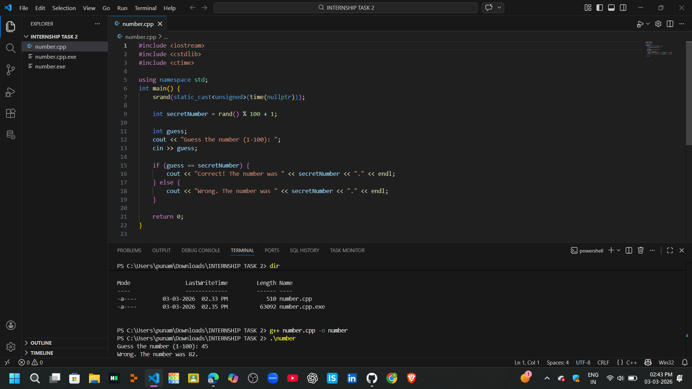

 # SCT_SD_2
 # SkillCraft Technology Internship

## 📌 Track
Software Development

## 📌 Task Number
Task 2

## 📌 Project Title
Number System Analyzer (C++)

---

## 📖 Project Description

This project is developed as part of Task 2 of the SkillCraft Technology Internship.

The program accepts an integer input from the user and performs the following checks:

- Even or Odd
- Positive or Negative
- Prime or Not
- Armstrong Number or Not

This project demonstrates the use of:
- Functions
- Conditional Statements
- Loops
- Mathematical Logic in C++

---

## 🛠 Technologies Used
- C++
- MinGW Compiler
- VS Code

---

## ▶️ How to Run

1. Open terminal inside project folder.
2. Compile:
```
g++ number.cpp -o number
```
3. Run:
```
.\number
```

---

## 📸 Output Screenshot

## 📸 Output Screenshot



---

## 👩‍💻 Author

Punam Abhang  
SkillCraft Technology Intern  

---

## 📂 Repository Naming Convention
SCT_SD_2
